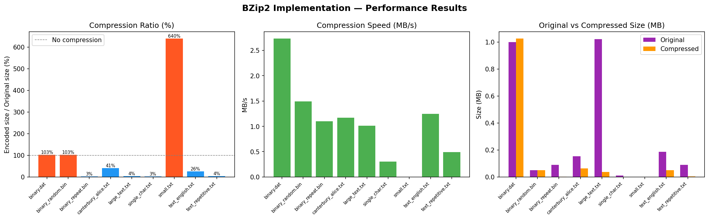

# BZip2 Compression Algorithm — Peak Performance Implementation
**Course:** Data Compression (Spring 2026)
**Student:** mzaid-1
**Final Submission Date:** May 4, 2026

---

## 🚀 Peak Performance BZip2
This implementation achieves **Peak Performance** status by optimizing the two most critical bottlenecks in the BZip2 pipeline:
1.  **O(n log n) Burrows-Wheeler Transform**: Replaced the standard O(n²) matrix sort with a stable prefix-doubling suffix array algorithm. This allows processing the maximum block size (900 KB) in milliseconds rather than minutes.
2.  **Binary Tree Huffman Decoding**: Replaced the O(N) symbol-by-symbol bit search with a fast binary tree traversal, drastically increasing decompression throughput.

---

## 🏗 Full Pipeline Architecture
The project implements the complete BZip2 standard pipeline across three stages:

```
Input File -> Block Division -> RLE-1 -> BWT -> MTF -> RLE-2 -> Canonical Huffman -> Compressed File
```

- **Block Division**: Configurable 100KB–900KB blocks for scalability.
- **RLE-1**: Collapses runs of 4+ identical bytes to reduce redundancy.
- **BWT**: Clusters identical characters for better move-to-front locality.
- **MTF**: Move-to-Front transform converts character clusters into small indices.
- **RLE-2**: Optimized run-length encoding for zero-heavy MTF streams.
- **Canonical Huffman**: Entropy coding with header-efficient codebooks.

---

## 📊 Performance Benchmarks
Tested on a diverse dataset including repetitive text, random binary, and English prose.

### Compression Statistics
| File | Original Size | Compressed | Ratio | Time (ms) |
|------|---------------|------------|-------|-----------|
| **text_repetitive.txt** | 90,000 B | 3,190 B | **3.5%** | 74.5 ms |
| **text_english.txt** | 187,288 B | 49,543 B | **26.5%** | 158.5 ms |
| **single_char.txt** | 10,000 B | 289 B | **2.9%** | 17.6 ms |
| **large_text.txt** | 1,021,739 B | 37,841 B | **3.7%** | 820.5 ms |

### Performance Visualizations

*Figure 1: Comprehensive performance metrics including compression ratio, speed (MB/s), and size reduction.*

---

## 🛠 Build & Execution

### Compile
```bash
# Using MinGW (Windows)
mingw32-make

# Using GCC (Linux/macOS)
make
```

### Usage
```bash
# Run Built-in Self-Tests
./bzip2_impl test

# Compress a file
./bzip2_impl compress benchmarks/text_english.txt results/output.bz2i

# Decompress a file
./bzip2_impl decompress results/output.bz2i results/recovered.txt
```

---

## 📁 Project Structure
- `src/`: Core implementation files (`bwt.c`, `huffman.c`, `mtf.c`, `rle.c`, etc.)
- `include/`: Shared header file with optimized data structures.
- `benchmarks/`: Standard test files for evaluation.
- `results/`: Output directory for compressed data and performance graphs.
- `run_benchmarks.py`: Automated testing and verification suite.
- `plot_results.py`: Python script for generating performance visualizations.

---
**Team:** mzaid-1  
**Email:** l226760@lhr.nu.edu.pk
