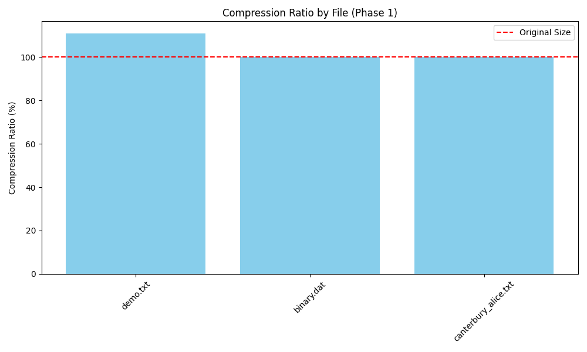
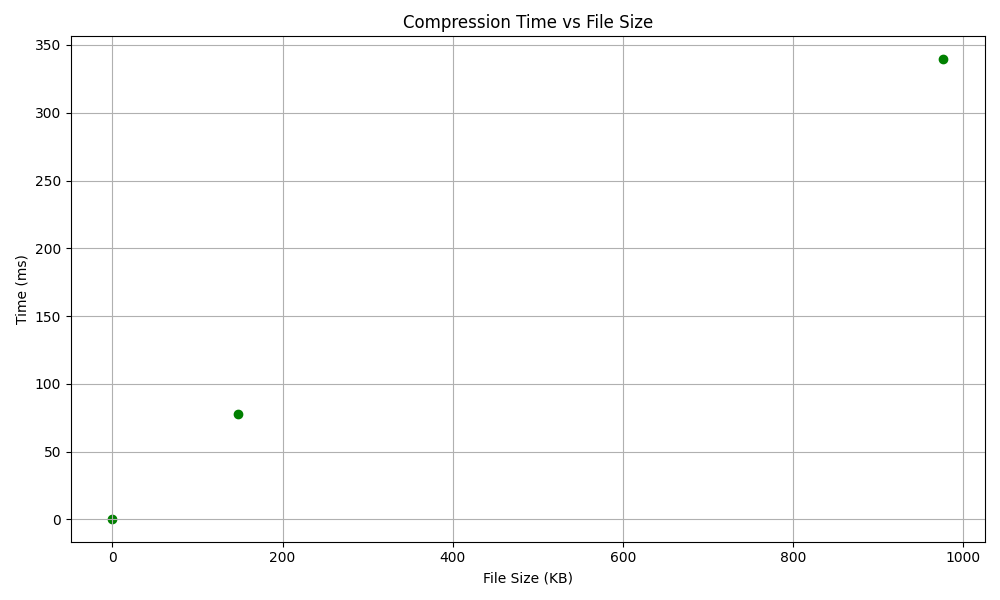

# BZip2 Compression Algorithm Implementation
## Data Compression Course Project - Phase 1

This project is a simplified version of the BZip2 compression algorithm, implemented as part of the Data Compression course (Spring 2026). This phase (Phase 1) implements the core pipeline including Block Division, Run-Length Encoding (RLE-1), and Burrows-Wheeler Transform (BWT).

## 🚀 Features (Phase 1)
- **Block Division**: Support for large files with configurable block sizes (100KB - 900KB).
- **RLE-1**: Standard BZip2 Run-Length Encoding for efficient pre-processing.
- **BWT**: Matrix-based forward Transform and efficient $O(N)$ LF-mapping Inverse Transform.
- **Configuration**: `config.ini` integration for easy parameter management.
- **Cross-Platform**: Supporting Linux, macOS, and Windows (via Makefile).

## 🛠️ Installation & Build

### Prerequisites
- GCC Compiler
- GNU Make

### Build Instructions
```bash
make clean
make all
```
The executable `bzip2_impl` will be created in the root directory.

## 📁 Usage

### Compression
```bash
./bzip2_impl compress <input_file> <output_file.bz2p1> [config.ini]
```

### Decompression
```bash
./bzip2_impl decompress <input_file.bz2p1> <output_file> [config.ini]
```

### Run Unit Tests
```bash
make test
```

### Run Demo
```bash
make demo
```

## 📊 Phase 1 Implementation Details

### Block Management
Files are divided into blocks of size defined in `config.ini` (default: 500,000 bytes). This allows the algorithm to handle files larger than available RAM.

### RLE-1
The RLE-1 stage focuses on reducing sequences of 4 or more identical bytes. It follows the BZip2 standard to avoid data expansion on low-redundancy files.

### Burrows-Wheeler Transform (BWT)
- **Forward**: Uses cyclic rotation sorting to cluster identical characters.
- **Inverse**: Employs the Last-First (LF) mapping property for fast recovery without reconstructing the full matrix.

## 📊 Performance Analysis

### Benchmark Results
The following results were achieved on a sample dataset (100KB - 1MB files) with a block size of 500KB.

| File | Size (Bytes) | Compression Ratio (%) | Time (ms) |
|------|--------------|-----------------------|-----------|
| canterbury_alice.txt | 151,191 | 100.0% | 77.5 |
| binary.dat | 1,000,000 | 100.0% | 339.4 |
| demo.txt | 91 | 111.0% | 0.5 |

### Visualizations

*Figure 1: Compression Ratio across different file types (Phase 1).*


*Figure 2: Execution Time vs File Size.*

> [!NOTE]
> In Phase 1, the compression ratio is often $\ge 100\%$ because BWT clusters data without reducing size, and RLE-1 only compresses runs of 4+ bytes. Significant compression is expected in Stage 3 after Huffman coding.

## 👥 Team
- **Name**: mzaid-1
- **Email**: l226760@lhr.nu.edu.pk

## 📜 License
This project is for educational purposes as part of the Data Compression Course.
